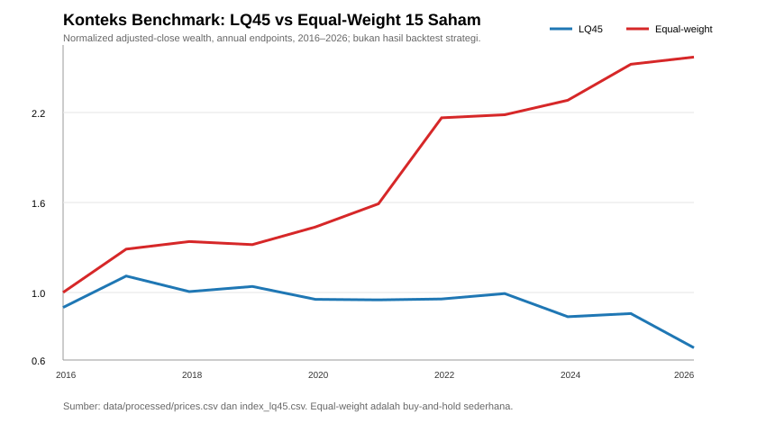
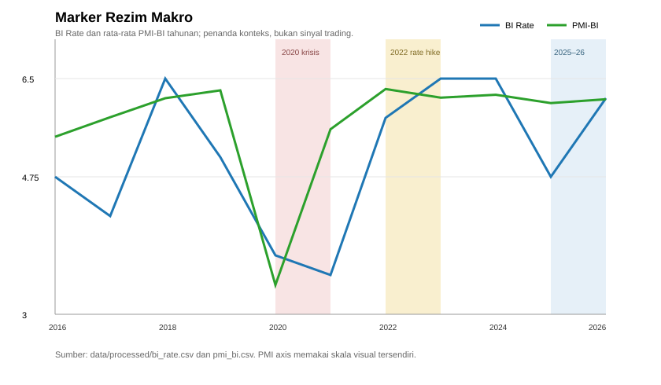

# Quant Finance Indonesia: Point-in-Time Backtesting & Portfolio Research

## Ringkasan

Project ini membangun pipeline riset kuantitatif untuk 15 saham yang digunakan sebagai universe LQ45. Fokus utamanya adalah menghasilkan sinyal, portofolio, dan evaluasi yang dapat diaudit tanpa lookahead bias: data makro hanya boleh dipakai setelah tanggal rilis yang dimodelkan, sinyal penutupan hari `t` dieksekusi pada hari perdagangan `t+1`, dan biaya transaksi dimasukkan dalam backtest.

## Business problem

Investor membutuhkan cara yang konsisten untuk menjawab tiga pertanyaan:

1. Apakah strategi teknikal, mean reversion, momentum, ML, atau optimasi portofolio menambah nilai dibanding LQ45 dan equal-weight 15 saham?
2. Apakah keunggulan tersebut tetap ada setelah fee broker dan slippage?
3. Apakah performanya stabil pada krisis 2020, kenaikan suku bunga 2022, dan periode 2025–2026?

Project ini bukan rekomendasi investasi. Tujuannya adalah membangun kerangka eksperimen yang transparan dan dapat direplikasi.

## Data

Semua file mentah berada di `data/raw/` dan dipertahankan tanpa perubahan. Dataset yang dipakai:

| Kelompok | File | Periode processed |
|---|---|---|
| Harga 15 saham | `adj_close_10y.csv` | 2016-09-22 s.d. 2026-09-21 |
| Indeks | `index_lq45_10y.csv` | 2016-09-22 s.d. 2026-09-22 |
| Kurs | `usdidr_10y.csv` | 2016-09-22 s.d. 2026-09-22 |
| BI Rate | `BI-7Day-RR_Sorted.xlsx` | 2016-09-22 s.d. 2026-08-19 |
| Inflasi | `Tingkat Inflasi Indonesia ( M - to - M).csv` | 2016-08-31 s.d. 2026-08-31 |
| Neraca perdagangan | `Neraca Perdagangan 2016 - 2026.csv` | 2016-08-31 s.d. 2026-07-31 |
| PDB | `Data PDB 2016-2026.csv` | 2016 Q1 s.d. 2026 Q2 |
| PMI-BI | `PMI Manufacturing.csv` | 2016 Q1 s.d. 2026 Q2 |
| Snapshot fundamental | `summary_metrics.csv` | kondisi snapshot 2026 |

### Keterbatasan data dan verifikasi 2025–2026

- File tidak membawa metadata provenance lengkap; sumber eksternal dan timestamp publikasi perlu ditambahkan bila project dipakai untuk produksi.
- Coverage 2025–2026 belum seragam: harga tersedia sampai September 2026, BI Rate dan inflasi sampai Agustus 2026, neraca perdagangan sampai Juli 2026, sedangkan PDB dan PMI-BI sampai Q2 2026. Karena itu, “data 2026” tidak boleh dianggap sebagai satu snapshot lengkap.
- Tidak tersedia data vintage/revisi. PDB, PMI, inflasi, dan neraca perdagangan dapat direvisi setelah rilis.
- `koreksi_manual.csv` digunakan untuk PDB dan seluruh koreksi dicatat di `data/processed/cleaning_log.csv`.
- Ditemukan 54 tanggal tambahan pada harga yang tidak ada di kalender indeks; seluruh return yang tersedia pada tanggal tersebut terverifikasi nol. Terdapat 24 observasi `Volume = 0` pada indeks; baris terakhir yang relevan dibuang saat cleaning.
- Publication lag adalah asumsi, bukan timestamp publikasi aktual. Konfigurasi saat ini di `src/build_master.py`: BI Rate 0 hari kerja, inflasi 5, neraca perdagangan 15, PDB 35, dan PMI-BI 5 hari kerja. Revisions, embargo, weekend/holiday khusus, dan jam rilis belum dimodelkan sempurna.

## Metodologi CRISP-DM

### 1. Business understanding

Merumuskan masalah alokasi aset dan pengujian sinyal dengan kontrol terhadap biaya, risiko, regime, dan lookahead bias.

### 2. Data understanding

`notebooks/01_data_understanding.ipynb` memeriksa shape, tipe data, rentang waktu, NaN, duplikat, statistik dasar, kalender libur, volume nol, konsistensi PDB, serta nilai ekstrem inflasi dan neraca perdagangan.

### 3. Data preparation

`notebooks/02_cleaning.ipynb` dan `src/data_cleaning.py` menghasilkan data processed. `src/build_master.py` memakai `merge_asof(direction="backward")` agar setiap harga hanya melihat data makro yang sudah dirilis. Log cleaning dan quality log disimpan di `data/processed/`.

### 4. Modeling

- `src/features.py`: SMA/EMA, RSI, MACD, Bollinger Bands, ATR proxy, momentum, volatilitas, dan fitur makro point-in-time.
- `src/strategy.py`: MA crossover 50/200, Bollinger-RSI mean reversion, dan momentum 12-1 bulanan.
- `notebooks/07_ml_signal.ipynb`: Logistic Regression, Random Forest, dan XGBoost/LightGBM dengan expanding walk-forward retraining setiap enam bulan.
- `notebooks/09_portfolio_optimization.ipynb`: Max Sharpe, Minimum Volatility, dan HRP dengan rolling window tiga tahun, rebalance tahunan, dan batas maksimum 20% per saham.
- `src/backtester.py`: eksekusi `t+1`, long-only tanpa leverage, fee beli 0,15%, fee jual 0,25%, dan slippage 0,05% sebagai default yang dapat disesuaikan.

### 5. Evaluation

`notebooks/10_evaluation.ipynb` membandingkan CAGR, volatilitas, Sharpe, Sortino, Max Drawdown, Calmar, win rate, dan turnover; memecah performa per rezim; menguji biaya 0x/1x/2x; serta menghitung bootstrap confidence interval untuk Sharpe.

### 6. Deployment

`dashboard/app.py` adalah dashboard read-only Streamlit. App hanya membaca artefak hasil dari `data/processed` dan tidak menjalankan optimasi atau backtest ulang.

## Hasil utama

### Tabel metrik out-of-sample

Angka final sengaja tidak diisi sebelum artefak evaluasi dijalankan. Ini mencegah README memuat angka in-sample atau angka yang tidak dapat direproduksi. Setelah `notebooks/10_evaluation.ipynb` selesai, tabel ini dapat diisi dari `data/processed/evaluation_metrics_all.csv`.

| Portfolio/strategi | CAGR | Vol. tahunan | Sharpe | Sortino | Max Drawdown | Calmar | Status |
|---|---:|---:|---:|---:|---:|---:|---|
| MA 50/200 | — | — | — | — | — | — | Jalankan evaluasi |
| Mean Reversion BB-RSI | — | — | — | — | — | — | Jalankan evaluasi |
| Momentum 12-1 | — | — | — | — | — | — | Jalankan evaluasi |
| ML signal | — | — | — | — | — | — | Jalankan evaluasi |
| Max Sharpe | — | — | — | — | — | — | Jalankan evaluasi |
| Minimum Volatility | — | — | — | — | — | — | Jalankan evaluasi |
| HRP | — | — | — | — | — | — | Jalankan evaluasi |
| Equal-weight 15 saham | — | — | — | — | — | — | Benchmark |
| LQ45 | — | — | — | — | — | — | Benchmark |

Snapshot filter kualitas fundamental yang sudah tersedia menempatkan KLBF, ANTM, dan PTBA sebagai tiga teratas. Ini adalah ranking statis kondisi 2026, bukan sinyal historis dan tidak boleh dipakai untuk backtest ke masa lalu.

### Gambar benchmark dan rezim





Gambar pertama adalah konteks buy-and-hold dari data processed, bukan klaim performa strategi. Gambar kedua menunjukkan marker makro yang dipakai untuk membaca stabilitas strategi di sekitar 2020, 2022, dan 2025–2026.

## Kesimpulan jujur dan kelemahan

Belum ada dasar yang sah untuk menyatakan strategi tertentu mengalahkan benchmark sebelum notebook evaluasi menghasilkan metrik out-of-sample setelah biaya. Kriteria yang digunakan di notebook adalah ketat: strategi harus mengungguli LQ45 dan equal-weight sekaligus pada CAGR dan Sharpe net. Jika tidak, kesimpulan yang benar adalah tidak ada bukti keunggulan yang cukup pada sampel tersebut.

Kelemahan utama:

- Sampel sekitar sepuluh tahun tetap kecil untuk menyimpulkan ketahanan lintas rezim.
- Publication lag dimodelkan sebagai lag hari kerja sederhana, bukan kalender rilis aktual.
- Tidak ada data vintage sehingga risiko revision/lookahead pada data makro belum dapat diuji penuh.
- Harga yang dipakai terutama adjusted close; open, spread, market impact, limit up/down, pajak, dan likuiditas belum sepenuhnya dimodelkan.
- Optimasi mean-variance sensitif terhadap estimasi return dan kovarians.
- Bootstrap Sharpe mengukur ketidakpastian sampling, bukan perubahan rezim atau data-snooping.
- Parameter strategi dan universe dapat menimbulkan overfitting bila tidak dikunci sebelum evaluasi.

## Cara menjalankan

```bash
python -m venv .venv
.venv\\Scripts\\activate        # Windows
pip install -r requirements.txt
```

Urutan kerja yang disarankan:

1. Jalankan `notebooks/01_data_understanding.ipynb`.
2. Jalankan `notebooks/02_cleaning.ipynb`.
3. Jalankan `src/build_master.py` atau cell build master terkait.
4. Jalankan `notebooks/04_eda.ipynb` dan `notebooks/07_ml_signal.ipynb`.
5. Jalankan `notebooks/09_portfolio_optimization.ipynb`.
6. Jalankan `notebooks/10_evaluation.ipynb` untuk menghasilkan tabel evaluasi.
7. Jalankan dashboard:

```bash
streamlit run dashboard/app.py
```

Dashboard mengharapkan artefak precomputed seperti `backtest_equity.csv`, `backtest_metrics.csv`, dan `backtest_weights.csv` di `data/processed`. Nama file alternatif didukung di loader `dashboard/app.py`.

## Struktur project

```text
data/raw/          # data mentah, tidak diubah
data/processed/    # data bersih, master, log, dan artefak hasil
notebooks/         # eksplorasi, cleaning, EDA, ML, optimasi, evaluasi
src/               # cleaning, feature, strategy, backtester
dashboard/         # Streamlit app
reports/figures/   # gambar yang dirujuk README
```
